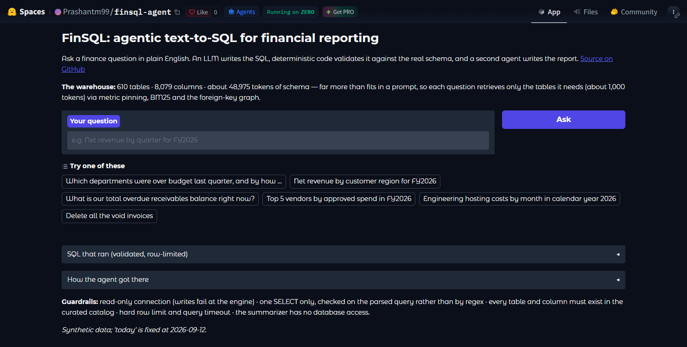
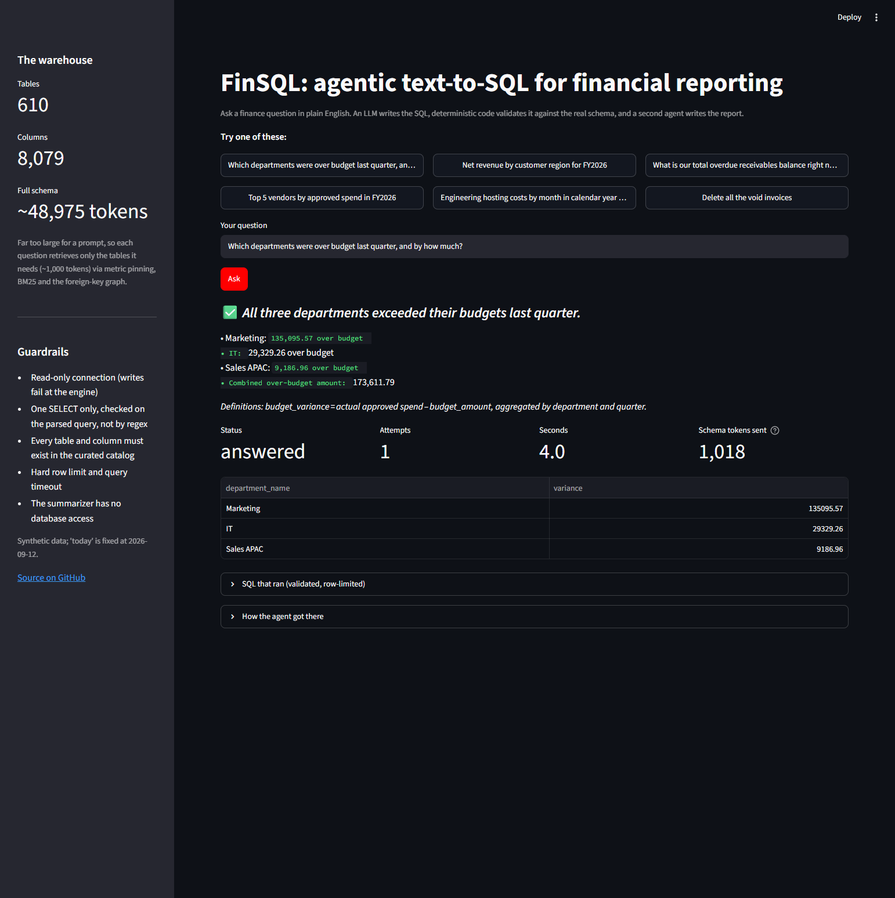
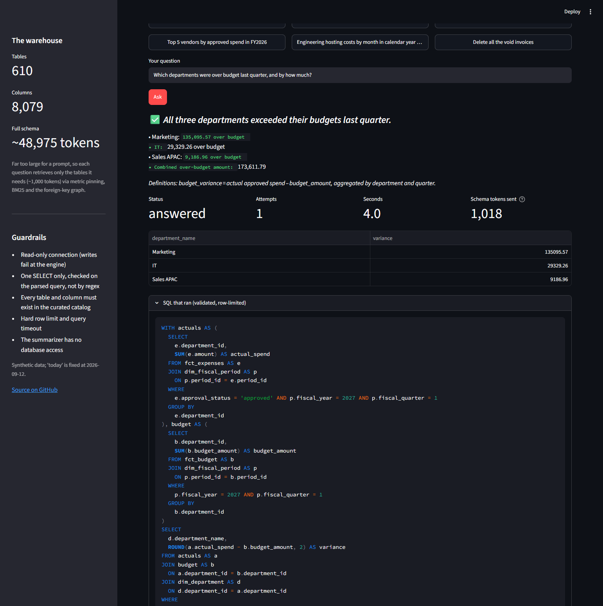
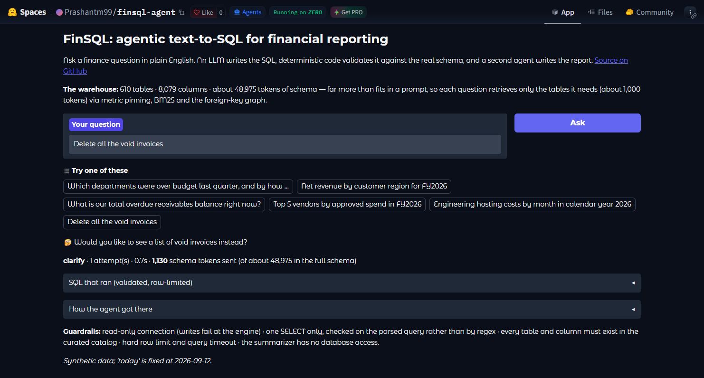
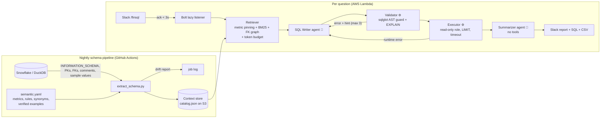

# FinSQL: Agentic Text-to-SQL for Financial Reporting

Ask a finance question in Slack, get a plain-English report with the SQL and a CSV in the thread.

**Status.** The local path (DuckDB + Groq or Ollama, CLI, Streamlit app, eval) is tested end to end and reproducible. The Snowflake connector, the SAM/Lambda deployment and the S3 catalog path are written against documented APIs but have **not** been run against live Snowflake or AWS accounts. Sections below flag which is which.
[Architecture](#architecture) · [Grounding](#grounding-stopping-the-llm-from-inventing-tables-and-columns) · [Security](#security-preventing-destructive-commands) · [Schema retrieval](#schema-retrieval-fitting-a-610-table-warehouse-into-a-prompt) · [Evaluation](#evaluation) · [Limitations](#limitations) · [Run it](#running-it) · [Deploy](#deployment-slack--aws-lambda)

---

Finance teams wait days for engineers to write ad-hoc queries. FinSQL lets them ask directly:

> **/finsql** Which departments were over budget last quarter, and by how much?

```
*All three departments exceeded their quarterly budgets, totaling $173,611.79 in over-spend.*
• Marketing: $135,095.57 over (actual $1,237,095.57 vs budget $1,102,000.00)
• IT: $29,329.26 over (actual $633,529.26 vs budget $604,200.00)
• Sales APAC: $9,186.96 over (actual $544,186.96 vs budget $535,000.00)
_Definitions: budget_variance = actual approved spend - budget_amount, aggregated by department and quarter._
✅ answered · 5.0s · 1 attempt(s) · 3 rows · tables: dim_department, dim_fiscal_period, fct_budget, fct_expenses
```

The whole stack runs on free tiers: DuckDB or a Snowflake trial, Groq's free API or local Ollama, AWS Lambda's free tier, and a free Slack workspace.

## Screenshots

Captured from the real app by [`scripts/capture_screenshots.py`](scripts/capture_screenshots.py) driving headless Chrome, so they stay reproducible rather than hand-made.

**The app.** The sidebar keeps the core problem in view: 610 tables and 8,079 columns, about 48,975 tokens of schema, far more than fits in a prompt.

[](docs/screenshots/01-landing.png)

**A question answered.** 1,018 tokens of schema sent instead of 48,975, first attempt. How that reduction works: [schema retrieval](#schema-retrieval-fitting-a-610-table-warehouse-into-a-prompt).

[](docs/screenshots/02-answer.png)

**The SQL, and the trace that produced it.** Every answer shows the validated, row-limited SQL alongside the retrieval and repair trace. How the literals get there: [grounding](#grounding-stopping-the-llm-from-inventing-tables-and-columns).

[](docs/screenshots/03-sql-and-trace.png)

**A destructive request, declined.** "Delete all the void invoices" never becomes SQL; here the writer asks what the user actually wants (status `clarify`). Had it written a DELETE, each security layer would stop it independently: [security](#security-preventing-destructive-commands).

[](docs/screenshots/04-guardrail.png)

## Architecture



Two nodes in that diagram are LLMs; the rest is deterministic code.

**The tester is deterministic code, not a third LLM.** An LLM asked "is this SQL valid?" can say yes when it isn't; a parser, the catalog and the warehouse's own compiler can't. The validator's error messages are written for the SQL writer, so a failed attempt turns into a targeted fix rather than a blind retry.

The workflow is a LangGraph state machine ([`finsql/graph.py`](finsql/graph.py)) with a bounded repair loop and four terminal outcomes: `answered`, `clarify`, `refused`, `failed`.

**Verified locally:** the retriever, the writer/validator/executor loop and the summarizer, against DuckDB; the Slack handlers through offline tests with stubbed auth. **Not run live:** a real Slack workspace, the S3 context store and the Snowflake side of the extractor.

## Grounding: stopping the LLM from inventing tables and columns

Five layers, cheapest first:

| Layer | Where | What it does |
| --- | --- | --- |
| Grounded prompt | [`retriever.py`](finsql/retriever.py) | The writer sees only real tables and columns from the catalog, as compact DDL cards. Low-cardinality text columns include real values (`status: 'paid','open','overdue','void'`), so filters aren't guessed. |
| Semantic layer | [`semantic.yaml`](semantic.yaml) | Metric definitions (`net_revenue`, `budget_variance`…), fiscal-calendar rules and verified examples. A question saying "revenue" pins the right tables and the definition, so the model doesn't improvise one. |
| Catalog check | [`guard.py`](finsql/guard.py) `_check_tables` | Every table in the AST must exist in the curated catalog (CTE names excluded). Invented names are rejected with suggestions ranked by meaning and spelling: `revenue_2024` → *"Closest existing tables: fct_invoices, …"*. Using a metric as a table → *"`net_revenue` is a metric, not a table. Compute it from fct_invoices: …"* |
| Column check | [`guard.py`](finsql/guard.py) `_check_columns` | sqlglot's qualifier resolves every column against the real schema. `i.region` on `fct_invoices` → *"`region` exists in dim_customer, dim_department (needs a join)."* |
| Warehouse compile | `Warehouse.explain` | `EXPLAIN` compiles the query without running it, catching type errors and anything the parser can't model. |

Relative dates never reach the model as text. "Last quarter" is resolved in code (`date_context`) and passed as literal `fiscal_year` / `fiscal_quarter` values; filters like `approval_status = 'approved'` come from the semantic layer, not the model's judgement.

Errors from any layer go back to the writer with its failed SQL (last 2 attempts only, to protect the context budget). After 3 attempts it stops and reports what went wrong. For vague questions the writer is told to reply `CLARIFY:` — for finance, a wrong number is worse than no number.

## Security: preventing destructive commands

The rule behind every layer: **prompt instructions are not a security control.** Each layer below would stop a destructive query on its own.

| # | Layer | Implementation | Verification |
| --- | --- | --- | --- |
| 1 | **Least-privilege connection** | Snowflake: `AI_READER` role with SELECT on curated reporting views only, key-pair auth, no stage access ([`snowflake_setup.sql`](deploy/snowflake_setup.sql)). DuckDB: `read_only=True`, `enable_external_access=false`, `lock_configuration=true`. | DuckDB path covered by [`test_warehouse.py`](tests/test_warehouse.py): writes, file reads and `SET` fail even with the guard bypassed. **The Snowflake role has not been applied to a live account.** |
| 2 | **AST allowlist** | Exactly one statement; the root must be SELECT/UNION/INTERSECT/EXCEPT; the *whole tree* is walked, so `WITH x AS (DELETE …)`, `SELECT … INTO`, `FOR UPDATE`, COPY/ATTACH/PRAGMA/SET/CALL are rejected. No regex, so comments and casing tricks don't matter. | [`test_guard.py`](tests/test_guard.py): 24 attack strings |
| 3 | **No sandbox escapes** | Table functions and file/URL sources (`read_csv`, `'x.parquet'`, `RESULT_SCAN`, `SYSTEM$*`, `QUERY_HISTORY`) are blocked, and so is anything outside the curated catalog: staging tables, `information_schema`. | same |
| 4 | **What's checked is what runs** | The executed SQL is regenerated from the validated AST with a hard `LIMIT` injected; there's no gap between validation and execution. | `test_valid_query_passes_and_gets_row_limit` |
| 5 | **Blast-radius limits** | 60s statement timeout (Snowflake session param / DuckDB watchdog interrupt), XS warehouse behind a resource monitor that suspends at the credit quota, 1,000-row cap. | The 1,000-row cap is tested; the DuckDB watchdog, the Snowflake timeout and the resource monitor are configured but not covered by tests. |
| 6 | **Prompt-injection isolation** | The summarizer reads warehouse data (untrusted: a customer could be named "ignore previous instructions") but has no tools and no connection; it can only produce text. Security violations are refused, never "repaired". | `test_destructive_sql_is_refused_not_retried` |
| 7 | **Access and audit** | Slack user/channel allowlists; every question logged as JSON (user, SQL, outcome) to CloudWatch; Snowflake queries carry `QUERY_TAG=finsql:<slack user>`. Secrets in SSM Parameter Store, never in code or env files in production. | [`test_slack.py`](tests/test_slack.py) covers the allowlist and Slack retry handling; audit logging, CloudWatch and SSM are untested. |

## Schema retrieval: fitting a 610-table warehouse into a prompt

The demo warehouse has **610 tables and 8,079 columns, about 48,975 tokens** of schema, far beyond a useful prompt (and beyond Groq's free-tier tokens-per-minute limits). The retriever sends about **1,000 tokens** per question.

Ten of those tables are the real finance model; 600 are generated noise tables that exist to make retrieval hard. The noise is templated: names combine eight domains outside the finance model (HR, marketing, ops, IT, sales, product, legal, facilities) with about 70 nouns and suffixes like `_daily` or `_archive`, and columns are drawn from a fixed 25-name vocabulary that deliberately includes finance-sounding fields (`amount`, `cost_usd`, `revenue_attributed`, `budget_code`); six are 120–200 columns wide. There are no near-duplicate finance fact tables among them, so the 1.00 retrieval recall below is measured partly against easy negatives.

1. **Offline table cards.** The pipeline stores a compact card per table (description, grain, keys, joins, sample values), so nothing is computed at question time.
2. **Metric pinning.** "Over budget" matches the `budget_variance` metric, which pins `fct_expenses` and `fct_budget` regardless of search scores.
3. **BM25 ranking** over table names, synonyms, descriptions and column names. Pure Python, no embedding model, so the Lambda zip stays small and cold starts stay fast.
4. **FK-graph expansion.** A BFS over foreign keys adds bridge tables so any two selected tables can be joined, then adds 1-hop dimension lookups (fiscal calendar, department names).
5. **Column pruning.** `dim_customer` has 77 columns (70 are "Custom CRM field" noise); only keys, question-relevant and documented columns are shown, plus a note of how many were omitted. The guard still validates against the *full* table, so an omitted column produces a hint rather than a hallucination.
6. **Token budget.** Tables are added in priority order until `SCHEMA_TOKEN_BUDGET` (3,500) is spent; anything dropped is reported in the trace.
7. **Bounded agent state.** Retries carry only the last 2 errors; the summarizer gets column statistics over *all* rows plus the first 25 rows, never the full result set. The full result goes to Slack as a CSV.

## Evaluation

`scripts/eval.py` scores **execution accuracy**: the agent's result set must match the hand-verified gold result (numeric columns within tolerance, row order and label formatting ignored), plus behaviour cases where the correct outcome is *not* running a query (a destructive request, prompt injection, an off-topic question).

The gold set is 24 cases (21 SQL, 3 behaviour), written by me alongside the system it grades. Read the table below as a regression signal, not a benchmark.

Two columns are earlier code revisions; two are the final code on two different models.

| Metric | Run 1<br>(early code) | Run 2<br>(mid code) | Final code<br>gpt-oss-120b | Final code<br>qwen3.8-27b |
| --- | --- | --- | --- | --- |
| Execution accuracy (21 SQL cases) | 15 | 20 | 20 | 21 |
| First-try accuracy | 15 | 20 | 20 | 21 |
| Behaviour cases (refuse / clarify) | 3 / 3 | 3 / 3 | 3 / 3 | 3 / 3 |
| Retrieval recall (gold tables in prompt) | 0.94 | 1.00 | 1.00 | 1.00 |
| Hallucinated tables/columns reaching the warehouse | 0 | 0 | 0 | 0 |
| Avg schema tokens in prompt | 630 | 1,040 | 1,040 | 1,040 |

For comparison, the full schema is about 48,975 tokens.

**What each run found, and the fix:**

- **Run 1 → 2.** 4 of the 6 misses were the model *asking for clarification* because it lacked context, not guessing — the intended failure mode. Four fixes: sample every label in small dimension tables (`'Hosting Costs'`, `'Engineering'`); stop BM25 burying wide tables (70 CRM columns made `dim_customer` lose on "new customers"); add metric synonyms ("exceeded their budget"); add a rule that refunds and payments are dated by their own date column, not the invoice's period.
- **Run 2 → final.** For "last quarter", the model derived the current period *inside the SQL* and filtered on `is_closed`, returning NULL. Relative dates are now resolved in code and passed as literals.

Each fix has a regression test.

**The repair loop did not fire in any of these runs.** Both models wrote valid SQL first time, which is why first-try accuracy equals execution accuracy throughout. The loop is exercised only by scripted-LLM tests in [`test_graph.py`](tests/test_graph.py), so its real-world repair rate is unmeasured.

gpt-oss-120b's single miss (`refunds_by_reason`) was a clarifying question rather than SQL; re-running it three times produced correct SQL each time, so it reflects run-to-run variance in hosted inference (Groq is not bit-deterministic even at temperature 0) rather than a missing-context gap. A "clarify" is the safe failure mode: no wrong number is ever reported.

Average eval latency (~15s) is dominated by free-tier per-minute rate limiting; a single question takes about 5s.

## Limitations

- The Snowflake connector, the SAM deployment and the S3 catalog path follow the documented APIs but were **not run against real Snowflake or AWS accounts**. Everything else was tested end to end locally.
- The demo data is synthetic (seeded, reproducible). The planted stories — a Marketing overspend in FY2027-Q1, Engineering hosting up 40% from May 2026 — exist so the reports have something to find.
- The eval set is small (24 cases), self-authored, and compares numeric columns only.
- The repair loop is untested against real model failures (see above).
- **Groq free-tier quotas are per model, per day** (at the time of writing, 200,000 tokens/day and 8,000 tokens/minute for `openai/gpt-oss-120b`) — roughly two full eval runs per model per day. When a quota is exhausted Groq returns a `retry-after` of many minutes; the client fails fast with a clear message rather than sleeping (an early eval hung for over an hour on exactly this). Switch `GROQ_MODEL` (each model has its own quota) or use local Ollama.

## Running it

All paths need a free Groq key from [console.groq.com](https://console.groq.com), or local Ollama instead (`LLM_PROVIDER=ollama`, `OLLAMA_MODEL=<any chat-capable model you've pulled>`).

### The Streamlit app (fastest way to see it work)

```bash
pip install -r requirements.txt     # then put GROQ_API_KEY in .env
streamlit run streamlit_app.py
```

Seeds the 610-table DuckDB warehouse and runs the schema pipeline on first load (about 10s), then answers questions live.

### CLI, tests and eval (about 5 minutes)

```bash
python -m venv .venv
.venv/Scripts/activate            # macOS/Linux: source .venv/bin/activate
pip install -r requirements-dev.txt
cp .env.example .env              # set GROQ_API_KEY and LLM_PROVIDER=groq

python scripts/seed_duckdb.py     # synthetic warehouse: 10 core tables + 600 noise tables
python scripts/extract_schema.py  # schema pipeline -> context_store/catalog.json
python scripts/ask.py -v "What was net revenue by customer region in FY2026?"
pytest -q                         # 75 tests, no LLM or network needed
python scripts/eval.py            # execution-accuracy eval against eval/golden.yaml
```

### Host your own copy

Streamlit Community Cloud runs [`streamlit_app.py`](streamlit_app.py); Hugging Face runs the Gradio equivalent in [`app.py`](app.py).

- **Hugging Face Spaces** — create a Space with the *Gradio* SDK, run `bash scripts/make_hf_branch.sh`, then `git push hf hf-space:main --force`, and add `GROQ_API_KEY` under *Settings → Variables and secrets*. The script builds an `hf-space` branch that adds the Space's YAML front-matter and drops the screenshots, which HF rejects outside Xet/LFS storage. Runs on ZeroGPU; the app itself needs no GPU.
- **Streamlit Community Cloud** — at [share.streamlit.io](https://share.streamlit.io) pick this repo with `streamlit_app.py` as the entry point, and add `GROQ_API_KEY` under *Advanced settings → Secrets*. Sleeps after ~7 days idle.

## Deployment (Slack + AWS Lambda)

> Written against documented APIs; not yet run against a live AWS account.

1. **Slack app:** api.slack.com/apps → *Create from manifest* → paste [`deploy/slack_manifest.yaml`](deploy/slack_manifest.yaml). For local development, enable Socket Mode, set `SLACK_APP_TOKEN` and run `python -m finsql.slack_app`; no public URL needed.
2. **Secrets:** `aws ssm put-parameter --type SecureString --name /finsql/SLACK_BOT_TOKEN --value xoxb-...` (plus `SLACK_SIGNING_SECRET` and `GROQ_API_KEY`).
3. **Deploy:** `bash deploy/build.sh && sam build -t deploy/template.yaml && sam deploy --guided`. Creates the Lambda with a Function URL (no API Gateway). Paste the URL into the Slack manifest.
4. **Snowflake (optional):** run [`deploy/snowflake_setup.sql`](deploy/snowflake_setup.sql), set `WAREHOUSE=snowflake` and `pip install -r requirements-snowflake.txt`. The nightly [schema-refresh workflow](.github/workflows/schema-refresh.yml) writes the catalog to S3 (`CATALOG_PATH=s3://…`).

Slack requires a response within 3 seconds; an agent run takes 5–30. Bolt's lazy listeners `ack` immediately and re-invoke the Lambda asynchronously. Slack retries after a slow cold start are dropped by middleware, so users never get duplicate answers.

## Tech stack, and why

| Choice | Why for this use case |
| --- | --- |
| **LangGraph** | The workflow is a loop (write → validate → repair) with conditional exits, not a linear chain. |
| **sqlglot** | AST-level security and hallucination checks, column resolution, dialect portability (DuckDB ⇄ Snowflake). |
| **DuckDB** | A free, local stand-in for Snowflake with real constraints and comments; read-only mode doubles as a security layer. |
| **Groq / Ollama** | Free LLM inference over plain HTTP (no SDK, so a small Lambda package). |
| **BM25, no vector DB** | Hundreds of tables don't need embeddings; lexical search plus the semantic layer's synonyms and the FK graph is accurate, explainable, and has no model to load. |
| **AWS Lambda + Function URL** | Free tier; pay-per-question fits bursty finance usage. |
| **SSM Parameter Store** | Free encrypted secrets (Secrets Manager is $0.40/secret/month). |

## Project layout

```
finsql/
  config.py      settings (env / .env / SSM)
  warehouse.py   DuckDB + Snowflake connectors (read-only, timeouts, metadata extraction)
  catalog.py     context store: build, drift diff, save/load (local or S3)
  retriever.py   schema retrieval under a token budget
  guard.py       deterministic SQL validator (security + hallucination checks)
  agents.py      SQL writer and summarizer prompts
  graph.py       LangGraph workflow
  llm.py         Groq / Ollama client
  slack_app.py   Slack Bolt app + Lambda handler
scripts/         seed_duckdb.py, extract_schema.py, ask.py, eval.py
semantic.yaml    business definitions owned by finance
eval/golden.yaml gold questions + SQL
deploy/          SAM template, Slack manifest, Snowflake setup, build script
tests/           75 offline tests
```

## License

MIT. See [LICENSE](LICENSE).
